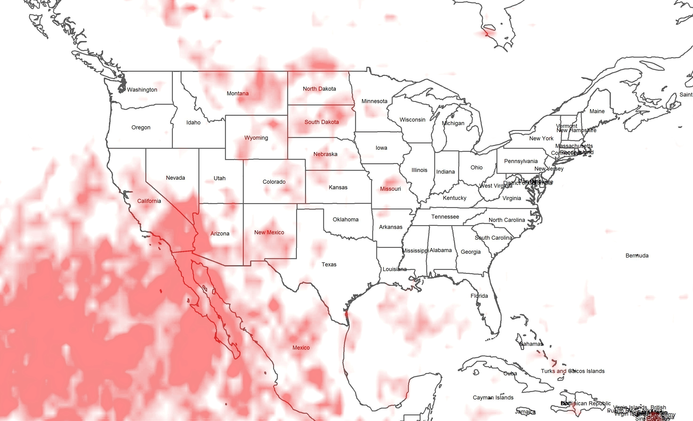
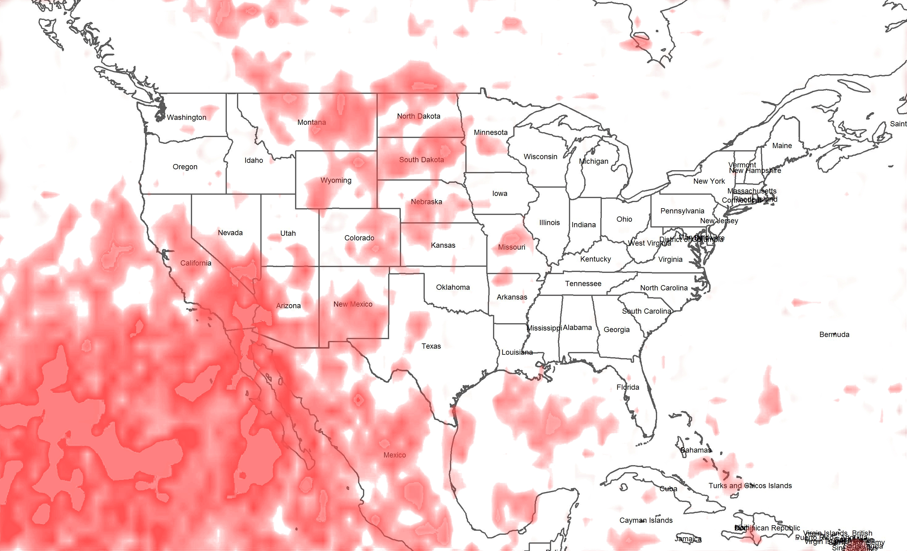

### Goal

JD has done some great work and I will see if I can continue in his direction. As JD pointed out in his initial analysis that time-dependence needs to be examined. I will explore the `PREC` variable and perform some exploratory analysis with the goal in mind to reduce the overall dimensions. My thought here is to simply look for observations that standout - outliers. This will then allow us to focus our analysis on a particuliar region of interest (instead of picking an arbitrary region at random), while simplifying our analysis, and saving our computers from a computational meltdown! 

***

#### Housekeeping

Before I start on that, I have to modify the initial function I wrote `getCDF.data`. Although it works in its current state, it is not particuliarly efficient and I am tired of waiting for my computer to crunch numbers! The current version of `getCDF.data` has one additional parameter, `asCube` which is a logical. The additional parameter allows the function to return the data retrieved as either a data.frame or an array. The data.frame works the same as in the first function version. The `asCube` array is able to perform calculations at lighting speeds and is the solution for us to be able to work with this hugh dataset. 

I will demonstrate the function in action below.

```{r message=FALSE, warning=FALSE}
file.maxt <- "../../data/era-interim/MAXT.nc" # Maximum temperature

source("load_netcdf.R")
source("../../r/helpers.R")

maxt.cube <- getCDF.data(filePath = file.maxt,
                         lonRange = c(223.5,301.5),                             
                         latRange = c(17.25,55.5),                             
                         timeRange = c(0, 14244),
                         asCube = TRUE)

maxt.by.year <- array(dim = c(105, 52, 39))

for (i in 1979:2017) {
  begin <- paste(i, 1, 1, sep = "-")
  end <- paste(i, 12, 31, sep = "-")
  
  ## Helper function to get "days since" range  
  range <- getTimeRange(begin, end, "1979-01-01") 
  ## Stores yearly average of MAXT in array. 
  ## NOTE: The second argument for the apply function takes on several variations as follows:
  ## 1 - apply function rowwise (lon)
  ## 2 - apply function columnwise (lat)
  ## 1:2 - apply function both rowwise and columnwise (lon, lat)
  maxt.by.year[, , i - 1979 + 1] <- apply(maxt.cube$mets$MAXT[, , range[1]:range[2]], 1:2, mean)
}

## Add dimension names for readability
dimnames(maxt.by.year) <- list(maxt.cube$dims$lon,
                               maxt.cube$dims$lat,
                               1979:2017)

## Retrieve mean MAXT for 1988
maxt.by.year[1:6, 1:6 , "1988"] %>% head()

## Since memory resources are precious, I suggest loading only one data 
## cube at a time and unloading it once done with. Can always reload later.
rm(maxt.cube)
## Trigger garbage collection to retrieve unused memory
gc()
```

As you can see the `getCDF.data` function call remains essentially the same. The difference is how we perform our calculations. The flexibility is apparent. For example, what if we wanted to know the cumulative precipation for a years worth?

```{r message=FALSE, warning=FALSE}
file.prec <- "../../data/era-interim/PREC.nc" # Precipitation

prec.cube <- getCDF.data(filePath = file.prec,
                         lonRange = c(223.5,301.5),                             
                         latRange = c(17.25,55.5),                             
                         timeRange = c(0, 14244),
                         asCube = TRUE)

prec.by.year <- array(dim = c(105, 52, 39))

for (i in 1979:2017) {
  begin <- paste(i, 1, 1, sep = "-")
  end <- paste(i, 12, 31, sep = "-")
  
  ## Helper function to get "days since" range  
  range <- getTimeRange(begin, end, "1979-01-01")   
  
  prec.by.year[, , i - 1979 + 1] <- apply(prec.cube$mets$PREC[, , range[1]:range[2]], 1:2, sum)
}

## Add dimension names for readability
dimnames(prec.by.year) <- list(prec.cube$dims$lon,
                               prec.cube$dims$lat,
                               1979:2017)

## Retrieve total PREC for 1988
prec.by.year[1:6, 1:6 , "1988"] %>% head()
```

What about monthly total precipitation?

```{r message=FALSE, warning=FALSE}
library(lubridate)

prec.by.month <- array(dim = c(105, 52, 468))

for (i in 1:468) {
  year <- ceiling(i / 12) - 1
  month <- ifelse(i %% 12 == 0, 12, i %% 12)
  
  begin <- paste(year + 1979,
                 month, 1, 
                 sep = "-")
  
  end <- paste(year + 1979, 
               month, days_in_month(as.Date(paste(year + 1979, month, 1, sep = "-"))), 
               sep = "-")

  range <- getTimeRange(begin, end, "1979-01-01") 
  
  ## Store monthly precipitation data
  prec.by.month[, , i] <- apply(prec.cube$mets$PREC[, , range[1]:range[2]], 1:2, sum)
}

dimnames(prec.by.month) <- list(prec.cube$dims$lon,
                                prec.cube$dims$lat,
                                1:468)

## Retrieve month total PREC for May 1988
prec.by.month[1:6, 1:6 , (1988 - 1979) * 12 + 5] %>% head()

rm(prec.cube); gc()
```

\newpage

Lets plot a raster map of 1988 for average maximum temperature and total precipitation.

```{r message=FALSE, warning=FALSE}
library(tidyverse)
library(ggplot2)
library(ggthemes)
library(reshape2)

## Convert arrays into long form for plotting
prec.long <- prec.by.year %>% melt() %>% rename(lon = Var1, lat = Var2, year = Var3, total.prec = value)  
maxt.long <- maxt.by.year %>% melt() %>% rename(lon = Var1, lat = Var2, year = Var3, mean.maxt = value)

ggplot() +
  geom_raster(data = maxt.long %>% filter(year == 1988),
              aes(x=lon-360,y=lat,fill=mean.maxt), interpolate = TRUE) +
  geom_contour(data = prec.long %>% filter(year == 1988), 
               aes(x=lon-360,y=lat,z=total.prec), color="white", alpha = 0.33) +
  labs(fill = "MAXT",
       title = "Mean MAXT and Total PREC - 1988") +
  conus.map() +
  theme_map()

```

***

#### Precipitation (PREC) Exploration with Time-Dependence

Here is where I will try to reduce the dimensions of our dataset by fitting a time series model at each spatial location (lon, lat) from 1979 to 2017 of monthly total precipitation and search for irregularities in the data by way of outliers. I will standardize the residuals and compare the entire spatial-temporal data for outliers. This will identify regions of anomalies sliced by time (months).

```{r message=FALSE, warning=FALSE}
library(tidyverse)
library(reshape2)
library(forecast)

file.prec <- "../../data/era-interim/PREC.nc" # Precipitation

prec.cube <- getCDF.data(filePath = file.prec,
                         lonRange = c(223.5,301.5),                             
                         latRange = c(17.25,55.5),                             
                         timeRange = c(0, 14244),
                         asCube = TRUE)

## Array to store residuals from time-series decomposition
prec.month.ts <- array(dim = c(105, 52, 468))

## Add dimension names for readability
dimnames(prec.month.ts) <- list(prec.cube$dims$lon,
                                prec.cube$dims$lat,
                                1:468)

rm(prec.cube)
gc()

for (lon in 1:105) {
  for (lat in 1:52) {
    ## Format data into time-series
    ts.data <- ts(prec.by.month[lon, lat, ], start = c(1979, 1), frequency = 12)
    
    ## Decompose time-series into seasonal, trend, and random components
    ts.model <- stl(ts.data, s.window = "periodic")

    ## Retrieve model residuals and store in array
    prec.month.ts[lon, lat, ] <- remainder(ts.model) %>% as.vector()
  }
}

## Standard deviation for spatial points across time
prec.month.ts.sd <- apply(prec.month.ts, 1:2, sd)

## Rescale all residuals
for (lon in 1:105) {
  for (lat in 1:52) {
    prec.month.ts[lon, lat, ] <- prec.month.ts[lon, lat, ] / prec.month.ts.sd[lon, lat]
  }
}

prec.month.ts.sd.long <- prec.month.ts %>% melt() %>% rename(lon = Var1, 
                                                             lat = Var2, 
                                                             time = Var3, 
                                                             sd.residual = value)

## Interested in residuals that are greater than 3 sd of the spatial-temporal data
outliers <- prec.month.ts.sd.long %>% filter(abs(sd.residual) > 3)

outliers %>% head()

```

Let see if our efforts captured any known anomalies. I will plot outliers from 2012 and see if we can "see" Hurricane Sandy.

```{r message=FALSE, warning=FALSE}
library(ggplot2)
library(ggthemes)

## (12*1:39) - 12
outliers <- outliers %>% mutate(year = ceiling(time / 12) - 1 + 1979, 
                                month = ifelse(time %% 12 == 0, 12, time %% 12))

outliers.2012 <- outliers %>% filter(year == 2012)

## Helper function to decide number of clusters. Similiar to a scree plot
wssplot(outliers.2012[, c("lon", "lat")]) 

## Create arbitrary clusters based on spatial points. More clusters results in smaller
## spatial regions and less clusters results in larger spatial regions
set.seed(1234)
cluster <- kmeans(outliers.2012[, c("lon", "lat")], centers = 5, nstart = 25)

## Assign spatial points to cluster
outliers.2012$cluster <- cluster$cluster

## Retrieve center of cluster
centers <- cluster$centers %>% as.data.frame()

ggplot(data = outliers.2012, aes(x = lon - 360, y = lat)) +
  stat_density2d(aes(fill = factor(cluster), group = factor(cluster)), geom = "polygon") +
  geom_point(aes(color = sd.residual), size = 4) +
  geom_label(data = centers, 
             aes(x = lon - 360, y = lat, label = 1:5), 
             size = 6) +
  scale_color_distiller(palette = "Spectral") +
  labs(fill = "Cluster",
       color = "Standardized Residuals",
       title = "Cluster(s) of Anomalies - 2012") +
  conus.map() +
  theme_map()

```

From the map above, it looks like cluster 2 could be the result of Hurricane Sandy leaving behind an unusual amount of precipitation. Keep in mind that the map plotted anomalies for the entire year - possibly anomalies before Sandy. Since our analysis has been on a monthly scale, lets take a look of each month for 2012.

```{r message=FALSE, warning=FALSE}
ggplot(data = outliers.2012, aes(x = lon - 360, y = lat)) +
  geom_point(aes(color = sd.residual, pch = factor(cluster)), size = 4, show.legend = FALSE) +
  scale_color_distiller(palette = "Spectral") +
  facet_wrap(~month) +
  conus.map() +
  labs(title = "Cluster(s) of Anomalies by Month (2012)") +
  theme_map()

## October 2012
ggplot(data = outliers.2012 %>% filter(month == 10), aes(x = lon - 360, y = lat)) +
  geom_tile(aes(fill = sd.residual), size = 4) +
  geom_label(data = centers, 
             aes(x = lon - 360, y = lat, label = 1:5), 
             size = 6) +
  scale_fill_distiller(palette = "Reds") +
  conus.map() +
  labs(x = "Longitude",
       y = "Latitude",
       fill = "Standardized Residuals",
       title = "Cluster(s) of Anomalies, October 2012") +
  theme_map()
```

There it is! At time 406 (October 2012) we captured Hurricane Sandy's unusual amount of precipitation and according to my Google search Hurricane Sandy officially made landfall October 29, 2012. I checked the path Hurricane Sandy took and it was, according to my map, from cluster 5 hugging the eastcoast to cluster 2. You can see that Hurricane Sandy dumped tremendous amounts of rain over cluster 5 working its way up towards cluster 2 and not dumping any unusual amount of precipitation in between. I would guess this is where Sandy picked up energy, ultimately dumping everything it had on New Jersey. 

As demonstrated above, we were able to capture an unusual event, Hurricane Sandy, by way of anomaly detection. My next question would be, what other known anomalies did we pick up? Or an even more interesting question would be what other anomalies did we pick up that is unknown? What effect did this unknown anomaly have on the region? Was this unknown event rare? Or does this unknown event repeat on a cycle? 

By finding these extremes in the data, we can use JD's smoothing model with additional data, for example, water quality for that region and analyze how these extreme events effect water quality at that region. Can we show that unusually low amounts of precipitation (drought) negatively effect water quality by concentrating contaminants and other particles? Or how about the other extreme? What can we say about a region that is saturated from precipitation? Ultimately, I believe the questions we answer that gives us the best chance of winning are questions that directly effect normal people's lives. Questions and answers that everyone can relate to. 

***

#### Regions of Interest for Investigation

The following map I am plotting collapses all the previously detected outliers onto a single two-dimensional map.

```{r message=FALSE, warning=FALSE}
outliers.summary <- outliers %>% group_by(lon, lat) %>% summarise(anomalies = n(), 
                                                                  mean = mean(sd.residual), 
                                                                  max = max(abs(sd.residual)))
plot.summary <-
  ggplot(data = outliers.summary, aes(x = lon - 360, y = lat)) +
  geom_raster(aes(fill = mean), interpolate = TRUE) +
  geom_text(aes(label = anomalies, size = factor(anomalies)), show.legend = FALSE) +
  scale_size_manual(values = exp(seq(0.75, 2.25, length.out = 15)) - 1) +
  scale_fill_distiller(palette = "RdBu") +
  labs(x = "Longitude",
       y = "Latitude",
       fill = "Mean Residual (strength)",
       title = "Anomaly Count and Strength (1979-2017)") +
  conus.map() +
  theme_minimal()

ggsave("anomalies-plot.jpg", plot.summary, height = 20, width = 30, units = "in")
```


***

The map is hard to see when outputed in this document, so I saved it as anomalies-plot.jpg in this file directory.

How I interpret the map is as follows: the numbers you see is a simple count of anomalies in the 39 years at that particuliar spatial point and the different sizes of the numbers just correspond to the count. It helps us see larger numbers over smaller numbers. The colors in the raster map can be interpreted as the overall strength of the anomalies. The "reds" tells us that when an anomaly occurs, the anomaly releases unusually high amounts of precipitation for that location. The "blues" tell us the opposite, indicating the anomalies over these locations releases unusually low amounts of precipitation. 

The above map has alot going on so I will try to simplify the map even more by creating arbitrary ranks for each of the spatial points as a weighted aggregrate of anomalies, mean residual (strength), and max residual. The weights are as follows: anomalies = 0.60, strength = 0.30, and max strength = 0.10. 

```{r message=FALSE, warning=FALSE}
outliers.summary <- outliers.summary %>% mutate(rank = anomalies * 0.60 + abs(mean) * 0.30 + abs(max) * 0.10)

spatial.points <- prec.month.ts.sd.long %>% group_by(lon, lat) %>% nest() %>% select(lon, lat) 
anomaly.points <- outliers.summary %>% group_by(lon, lat) %>% nest() %>% select(lon, lat)
void <- anti_join(spatial.points, anomaly.points)

ggplot(data = outliers.summary, aes(x = lon - 360, y = lat)) +
  geom_raster(aes(fill = rank), interpolate = TRUE) +
  geom_tile(data = void, fill = "black") +
  scale_fill_distiller(palette = "Reds") +
  labs(x = "Longitude",
       y = "Latitude",
       fill = "Rank",
       title = "Spatial Anomaly Strength by Rank (1979-2017)") +
  conus.map() +
  theme_minimal()

```

At last, we are guided by the bright areas on the map as potential areas of interest for further research. For example, the border of southern California, Nevada, Arizona, and Baja Mexico lights up like a beacon. Another region is central Missouri or most of Montana. There are numerous other locations for us to consider. The black spots on the map are voids (no detected anomaly).

Afterwards, I took the "Spatial Anomaly Strength by Rank (1979-2017)" plot above and post processed the image by adjusting the contrast and brightness levels to bring the bright spots out. I saved two processed images in this file directory (anomaly-map-processed-1 and anomaly-map-processed-2)

\newpage

##### Processed Images



***



If we wanted to, we could seperate the `outliers.summary` by unusually low and unusually high precipitation, re-rank the anomalies, and replot the heat map.

***

#### Conclusion

The goal I set out at the beginning of this report was to reduce the spatial dimension of our dataset to allow for targeted analysis. I believe the analysis above will guide us in subsetting the CONUS map. An after thought that I think would be insightful is to superimpose the "Spatial Anomaly Strength by Rank (1979-2017)" plot over a terrain map, rivers and lakes, national parks, highways, city, etc. This could provide some guidance in region selection. The above analysis of the `PREC` variable could be easily swapped out for `MAXT` or `MINT` and reanalyzed. I hope this will help guide us moving forward with targeted analysis and additional data collection efforts. 